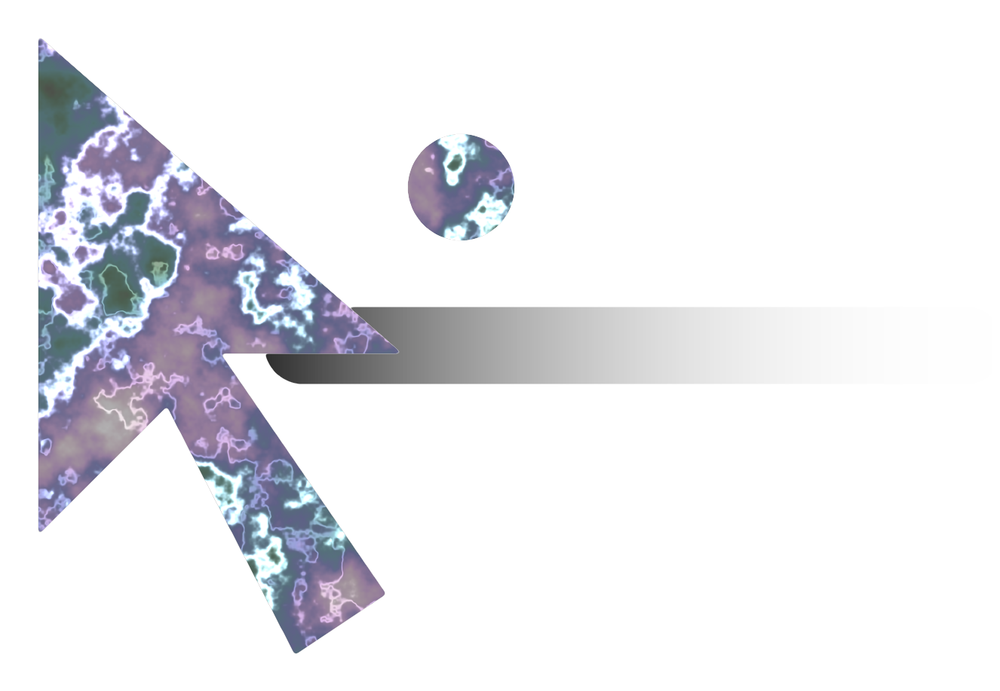

<p align="center">
  
</p>

<h1 align="center">Pointer Magic</h1>

<p align="center">
  A small app for your Mac that sits next to the real mouse pointer.<br />
  It can show which coding agent is ready, or show simple context for what is under the pointer.
</p>

<p align="center">
  <a href="https://maceip.github.io/pointer-magic/"><strong>Install guide</strong></a>
  ·
  <a href="#quick-start">Quick start</a>
  ·
  <a href="LICENSE">MIT license</a>
</p>

<p align="center"><em>One shelf. Every agent. Right under your hand.</em></p>

<p align="center">
  <video src="docs/demo/pointer-magic-demo.mp4" width="720" autoplay loop muted playsinline controls></video>
</p>

---

## Who this is for

| You | Start here |
| --- | --- |
| You run several local coding agents and lose track of who finished | Case 1 below |
| You do not use a coding agent, but want a small shelf of context under the pointer | Case 2 below |
| You want to add your own shelf content in code | See the shelf provider docs in the native app folder |

You do not need a cloud account or an api key for the app itself.

## What happens when you clone this

1. Clone the repo on a Mac with macOS 14 or newer.
2. Build the app with Swift. You need xcode or the apple command line tools.
3. A menu bar icon appears. The app stays quiet until you grant permissions.
4. You do not need a config file. Agents are found from the usual local folders on your Mac. Context under the pointer uses accessibility, and optional screen recording for on-device text reading.

The goal for a first run is simple: build the app, grant permissions, then within a few minutes either see agent state or a context shelf when you pause the mouse.

## Quick start

```bash
git clone https://github.com/maceip/pointer-magic.git
cd pointer-magic/apps/pointer-magic-macos
./scripts/build-app.sh --open
```

Then:

1. Find the pointer magic icon in the menu bar near the clock.
2. Right-click the icon and choose request next permission. Do this again after each toggle in system settings.
3. Leave pointer magic checked in the menu.
4. Pause the pointer. You will not get a new system cursor. You may see a small companion shelf when there is something to show.

Left-click the menu bar icon to park the shelf. Right-click for the menu. Click the parked shelf to use it. Use the dismiss control to hide that update.

If you rebuild often and want permissions to stick to the same app identity, set the POINTER_MAGIC_CODESIGN_IDENTITY environment variable to your local apple development identity, then run the build script again with --open.

## Two cases

### Case 1. Which agent is ready

Keep using ghostty, terminal, or cursor with your agents as usual. Install pointer magic and grant input monitoring and accessibility. Grant automation only if you want one click to jump to that agents terminal.

You should see a small shelf with the agent provider, folder, and state as sessions appear or change. When something finishes or needs you, the shelf is a quick answer to which agent.

Try parking the shelf, then clicking it to focus that agents terminal. That focus step only runs when you click.

### Case 2. What is under my pointer

Same install. Grant accessibility. Grant screen recording if you want on-device text reading. You do not need codex, claude, or cursor running.

When the pointer settles over ordinary apps like mail, notes, or a browser, a shelf can show local context and simple actions from the built-in sample provider. Same app, different job.

## Configuration

Day one needs no configuration file.

If you want to extend the shelf in code, read the shelf providers doc under apps/pointer-magic-macos/docs and the native readme in that folder. The core app does not start a network client or remote runtime.

## Repository map

- apps/pointer-magic-macos is the native mac app
- docs/index.html is the github pages install guide
- apps/showcase is an older browser lab, optional
- apps/pointer-magic-macos/README.md has deeper native notes

## Privacy

Screen crops, on-device text reading, and agent session discovery stay on your Mac. Terminal focus runs only after you click a parked shelf. More detail is in SECURITY.md.

## License

MIT. See LICENSE.
